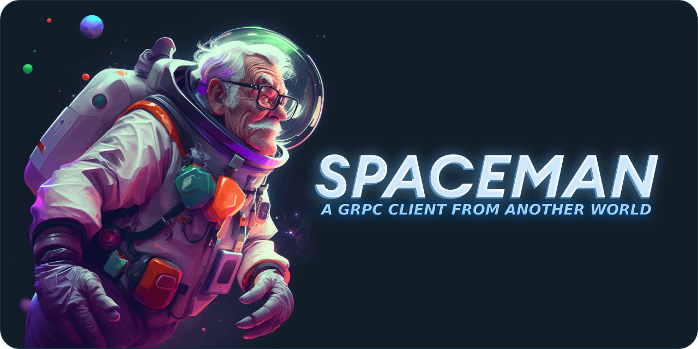

Spaceman is a cross-platform gRPC client designed to be pleasant to use and pretty to look at. It is available both as a desktop GUI and as a CLI. Its main use-case is manual testing and debugging of gRPC server: simply load a [Protobuf](https://protobuf.dev/programming-guides/proto3/) descriptor, choose your request, fill in the input message body and send away, to infinity and beyond!

TODO Nice screenshot of GUI executing stream request

## Ok but what's gRPC

[gRPC](https://grpc.io/) is a modern high-level communication protocol developed at Google. In my mind, gRPC falls more or less in the same basket as HTTP. Nowadays, the latter is not just limited to serving webpages and REST APIs anymore: many applications, that have nothing to do with the web, communicate using it. I like to think of gRPC as a better way to do that.

Some of the advantages are:
- A dedicated, official, SDK is available for [many programming languages](https://grpc.io/docs/languages/). The SDK includes code generation utilities that make serving a gRPC service, or consuming one, a breeze as all the encoding, decoding, and data validation is done for you. For instance, calling a procedure on a remote server is as easy as calling a generated function and building a server usually boils down to implementing a method for each available endpoint.
- Exchanged messages are strongly typed with the [Protobuf3](https://protobuf.dev/programming-guides/proto3/) schema language (some degree of free-typing is opt-in). This is great for avoiding the headaches of fields missing or having an unexpected type. In my experience, the schema file alone is already great documentation in and of itself when working in a small team. See [./playground/proto/playground.proto](playground.proto) for an example.
- When working with a compiled language, the code generated by the SDK provides useful static typing. If your application doesn't communicate correctly, it won't even compile.
- Messages are binary encoded and, because there is no need for them to be self-describing, they are [usually smaller than their JSON-encoded counterpart](https://nilsmagnus.github.io/post/proto-json-sizes/). Encoding and decoding the messages is performant and often takes [less time than `JSON.parse`-ing the same message in JavaScript](https://auth0.com/blog/beating-json-performance-with-protobuf/).
- Apart from the usual "send a request, receive a response", gRPC also supports the client and/or the server asynchronously sending messages as long as they want to. When a procedure is _streaming_ from both sides, you effectively have full-duplex communication just like [WebSockets](https://developer.mozilla.org/en-US/docs/Web/API/WebSockets_API) or [socket.io](https://socket.io/).
- [It is interoperable with HTTP if you need it](https://github.com/grpc/grpc-web).

## In Action

https://user-images.githubusercontent.com/6002855/229349667-a199b57d-9ba3-4349-9bbc-7e46f38ef1a8.mp4

## Building

## Usage

## Technology Stack

Spaceman is built in [Rust](https://www.rust-lang.org/) using [Tonic](https://github.com/hyperium/tonic) (part of the [Tokio ecosystem](https://tokio.rs/)) for making gRPC calls and heavily relies on [Prost-Reflect](https://crates.io/crates/prost-reflect) to interpret Protobuf messages not known at compile time. That's the core of it, the CLI is just a facade built with [Clap](https://github.com/clap-rs/clap).

The GUI uses [Tauri](https://tauri.app/) as a framework for making webview-based desktop apps and the actual frontend is made with [Yew](https://yew.rs/): a Rust reactive framework that compiles down to [WebAssembly](https://webassembly.org/).

## Miscellaneous

**Q: Is the project actively maintained**  
A: Not really, I built this for my own usage (if even that) just because I felt like building something cool with Rust and I thought it came out nice enough to give it a logo and a detailed README.

**Q: I'm on Linux and the app behaves weirdly at times**  
A: This is something that I experienced myself but I really can't do much about it. Tauri uses WebKit2GTK for rendering the webview on Linux and unfortunately, it doesn't play too nicely with WebAssembly. From my (limited) research, the issues that arise more frequently were solved in WebKit a long time ago but the fixes haven't made it into WebKit2GTK yet.
